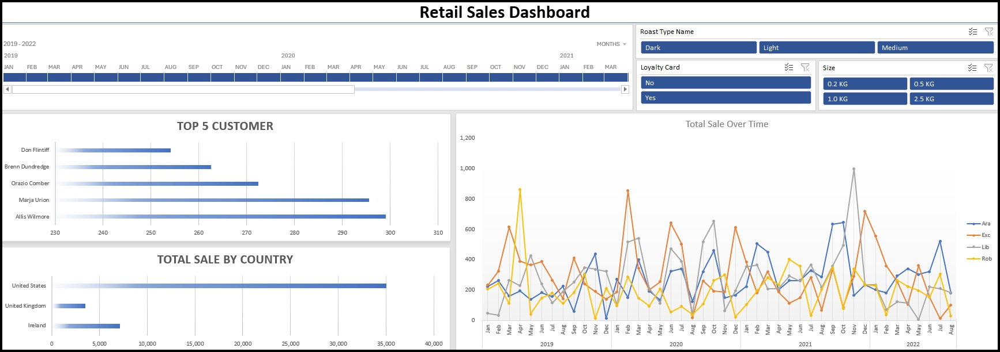

# 📊 Retail Store Sales Dashboard (Excel)

## Dashboard Preview


---

# 📌 Project Overview

This project is an interactive **Retail Store Sales Dashboard** built entirely in **Microsoft Excel**.

The project demonstrates real-world Excel data analysis skills including **data cleaning, data manipulation, lookups, Pivot Tables, Pivot Charts, Slicers, Timelines, and dashboard design**.

The dashboard allows users to filter data dynamically and analyze sales performance across different dimensions such as country, job category, sales representatives, dates, and more.

---

# 🚀 Features

- Interactive Dashboard
- Dynamic Slicers
- Timeline Filter
- Pivot Tables
- Pivot Charts
- KPI Cards
- Automatic Filtering
- User-Friendly Layout
- Professional Dashboard Design

---

# 📈 Dashboard Includes

- Total Sales
- Total Orders
- Total Customers
- Sales by Country
- Sales by Category
- Monthly Sales Trend
- Top Performing Categories
- Interactive Filtering
- Timeline Analysis

---

# 🛠 Excel Skills Demonstrated

## Data Cleaning

- Removed duplicate records
- Removed unnecessary spaces using `TRIM()`
- Fixed inconsistent text formatting
- Corrected missing values
- Standardized data
- Converted data types
- Organized raw datasets

---

## Data Analysis

- Pivot Tables
- Pivot Charts
- Sorting
- Filtering
- Grouping Dates
- Monthly Analysis
- Category Analysis
- Country Analysis

---

# 💡 Excel Techniques Used

### Cleaning

- TRIM
- Remove Duplicates
- Find & Replace
- Format Cells
- Data Validation

### Lookup

- XLOOKUP
- IFERROR

### Analysis

- Pivot Table
- Pivot Chart
- Sorting
- Filtering

### Dashboard

- Timeline
- Slicer
- Dynamic Charts
- KPI Cards
- Formatting
- Conditional Formatting

---

# 🖥 Tools Used

- Microsoft Excel
- Pivot Tables
- Pivot Charts
- Slicers
- Timeline
- Excel Formulas
- Conditional Formatting

---

# 📂 Repository Structure

```text
Retail_store_excel_dashboard/
│
├── images/
│   ├── ExcelDash.jpg
│
├── source/
│   ├── Retail Store Dashboard.xlsx
│   └── Retail Store Dataset.xlsx
│
├── LICENSE
└── README.md
```

---
